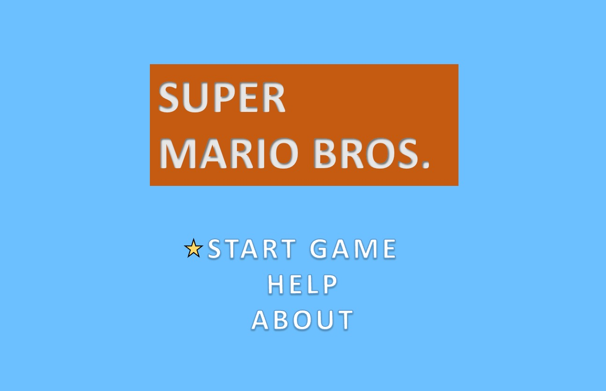
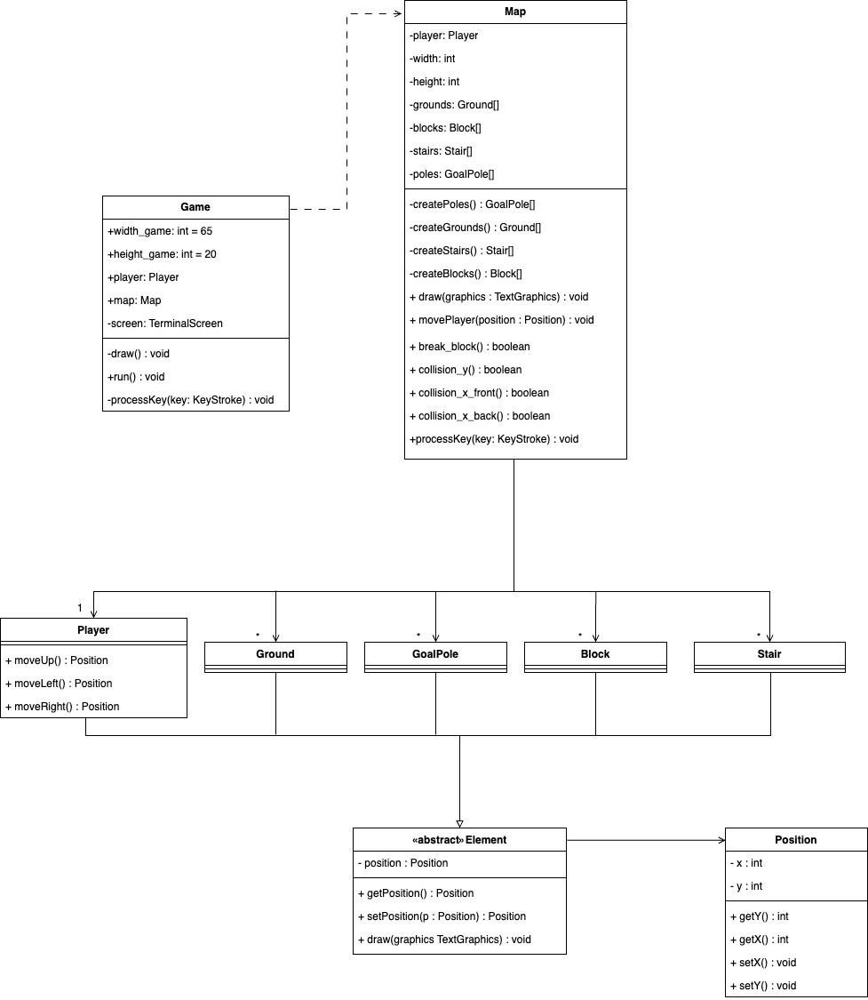

# LDTS_11_6 - Super Mario Bros
### 2023/2024
* Duarte Marques; up202204973@up.pt
* Maria Vieira; up202204802@up.pt
* Marta Cruz; up202205028@up.pt
#### Todos os mesmos participaram de igual forma para o desenvolvimento do projeto.

## Objetivo
Percorrer o mapa, passando por diversos obstáculos e chegar à bandeira final, sem esgotar todas as vidas.

## Comandos
* ```<``` : Mover para trás;
* ```>``` : Mover para a frente;
* ```^```  ```^``` : Saltar;
* ```^``` ```>``` : Saltar para a frente;
* ```^``` ```<``` : Saltar para trás.

## Funcionalidades
* Partir blocos ao saltar por baixo deles;
* Subir aos blocos e escadas;

## MENU - modelo
(ainda por implementar)


Figura 1: Modelo do Menu Inicial.


### Video Demonstrativo do Jogo - [ldts.mp4](ldts.mp4)


## Design Pattern
Para a implementação do projeto foi utilizado o Factory Method.
Este Pattern permite que as subclasses (com.aor.supermario.Player, com.aor.supermario.elements.Ground, com.aor.supermario.elements.GoalPole, com.aor.supermario.elements.Block e com.aor.supermario.elements.Stair) escolham o tipo de objetos a serem criados. Além disso, promove a reutilização de código.



Figura 2: Factory Pattern implementado no UML.
